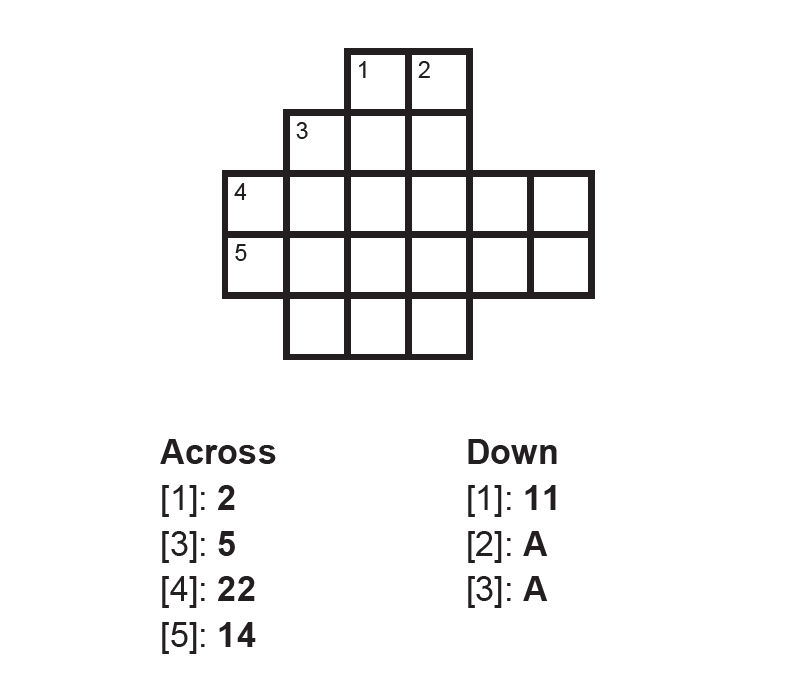
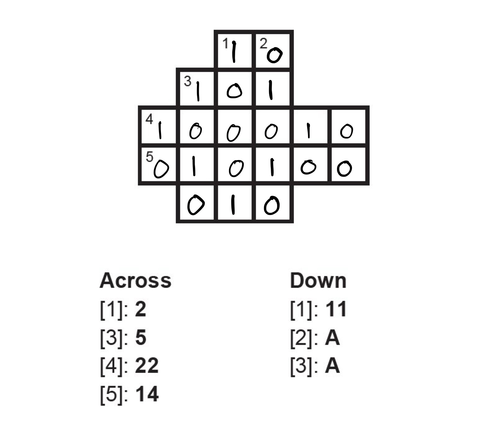
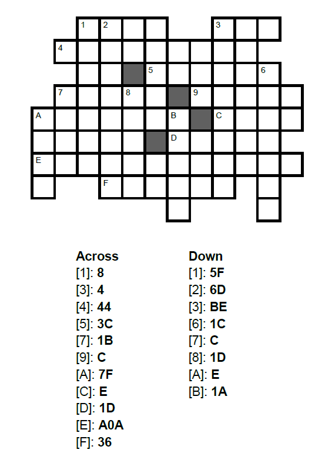
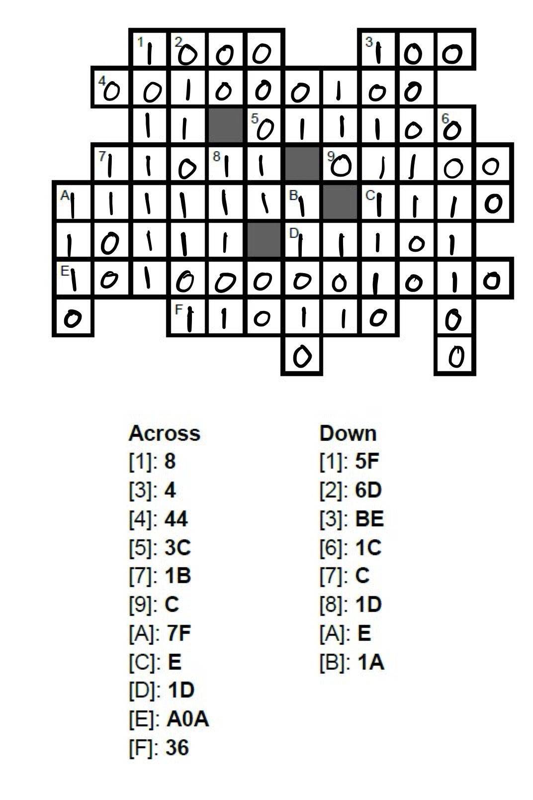

## Exercises: Numeral Systems

### Exercise 1: Modular Arithmetic & GCD

a. Find gcd(102, 38)

 

 

$2$

 

Two numbers, $a$ and $b$, are called *relatively* prime if gcd $(a, b)=1$. Based on this concept, answer b-c.

b. Is 2 relatively prime to 5?

 

 

Yes

 

c. Are 15 and 20 relatively prime to each other?

 

 

No

 

If $n$ is some positive integer, we can calculate how many of the numbers between 1 and $n$ that are relatively prime to $n$ as $\varphi(n)$ - this function is called Euler's phi-function. Use Euler's phi-function to answer d-f.

d. What is $\varphi(15)$?

 

 

8

 

e. What is $\varphi(14)$?

 

 

7

 

f. How is the prime factorisation linked to the concept of $\varphi(n)$?

 

 

If $n = pq$, where $p$ and $q$ are prime, then $\varphi(n) = (p-1)(q-1)$?

 

### Exercise 2: Binary to Decimal

Convert the following binary numbers into decimal numbers.

d. $110$

 

 

$6_{10}$

 

b. $1110111100_2$

 
  
 

$956_{10}$

 

c. $1001101110110_2$

  
  
 

$4982_{10}$

 

### Exercise 3: Decimal to Binary
State the binary expansion of the following values and then state the number in binary. 

a. $49$

  
  
 

$1\cdot2^5 + 1\cdot2^4 + 0\cdot2^3 + 0\cdot 2^2 + 0\cdot 2^1 + 1\cdot2^0$

$110001$

 

b. $212$

  
  
 

$1\cdot 2^7 + 1\cdot 2^6 + 1 \cdot 2^4 + 1 \cdot 2^2$

$11010100_2$

 

### Exercise 4: Convert to Decimal
State the hexadecimal expansion of the following values and then state the number in decimal. 

a. $37D_{16}$

  
  
 

$3 \cdot 16^2 + 7 \cdot 16^1 + 13 \cdot 16^0$

$893_{10}$

 

b. $1 A 9_{16}$

  
  
 

$1 \cdot 16^2 + 10 \cdot 16^1 + 9 \cdot 16^0$

$425$

 

### Exercise 5: Hex and Binary

Solve the “crossbins” below. The clues are in hexadecimal, and the answers should be in binary.  
**Note**: If your number is too short, add zeros in front!

  
  
 

 

  
  
 

 

 

### Exercise 6: Hex and Binary

Let $S$ be the set of all binary numbers with 7 characters, and let $f$ be a function from $S$ to $\mathbb{Z}$ given by $f(x) = x_{10}$.

a. Determine $f(111010)$.

b. The order of a set is number of elements in a set. For instance the order of ${1, 5, 7, 19, 27, 39} is 6. Determine the order of the set $S$
