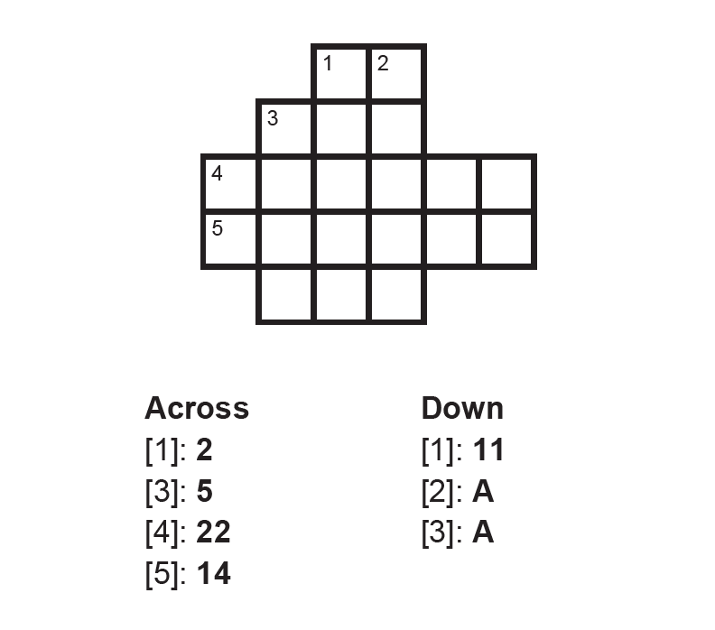

# 3. Numeral Systems

### Session Preparation:

Brooks: [Chapter 3](https://drive.google.com/file/d/1P9eidJb5qtlZgvHCtqu4uuPa5FFU0Zpn/view?usp=sharing).

### Session Material:

[Session notes](https://drive.google.com/file/d/1l257MXhxTxgXfmuQCqvEw-de3mvgyN1K/view?usp=sharing)

[Session Resources](https://viaucdk-my.sharepoint.com/:f:/g/personal/rib_viauc_dk/EqAdL2IjxBJIuhBYvL12T8QBaS3fV4FBRbkdF18Koob8sQ?e=EYK2t4)

--------------------------

### Topic Description
Numeral systems are methods for expressing numbers using a consistent set of symbols. The four most commonly used numeral systems in computing and mathematics are decimal, binary, octal, and hexadecimal.

1. **Decimal (Base 10):**
  
    - The decimal system is the most familiar, used in everyday counting and calculations. It is a base-10 system, meaning it uses ten digits: 0 through 9. Each position in a decimal number represents a power of 10.

2. **Binary (Base 2):**
    - The binary system is fundamental in computing and digital electronics. It is a base-2 system, meaning it uses only two digits: 0 and 1. Each position in a binary number represents a power of 2.

3. **Octal (Base 8):**
    - The octal system is a base-8 system, using eight digits: 0 through 7. Each position in an octal number represents a power of 8.

4. **Hexadecimal (Base 16):**
    - The hexadecimal system is widely used in computing to represent binary data in a more human-readable form. It is a base-16 system, using sixteen symbols: 0-9 and A-F, where A represents 10, B represents 11, and so on up to F, which represents 15. Each position in a hexadecimal number represents a power of 16.

These numeral systems are used to simplify data representation, processing, and conversion.

#### Key Concepts
- Positional numeral systems
- Binary expansion
- Binary operations
- Binary addition and multiplication
- Converting between binary, decimal, octal, and hexadecimal

--------------------------
### Exercises for recitation

#### Exercise 1: Modular Arithmetic & GCD

a. Find gcd(102, 38)(1)
{ .annotate }

1. $2$

Two numbers, $a$ and $b$, are called *relatively* prime if gcd $(a, b)=1$. Based on this concept, answer b-c.

b. Is 2 relatively prime to 5? (1)
{ .annotate }

1. Yes

c. Are 15 and 20 relatively prime to each other?(1)
{ .annotate }

1. No

If $n$ is some positive integer, we can calculate how many of the numbers between 1 and $n$ that are relatively prime to $n$ as $\varphi(n)$ - this function is called Euler's phi-function. Use Euler's phi-function to answer d-f.

d. What is $\varphi(15)$?(1)
{ .annotate }

1. 8

e. What is $\varphi(14)$? (1)
{ .annotate }

1. 6

f. How is the prime factorization linked to the concept of $\varphi(n)$?

??? answer "&nbsp;"

    If $n = pq$, where $p$ and $q$ are prime, then $\varphi(n) = (p-1)(q-1)$?

#### Exercise 2: Binary to Decimal

Convert the following binary numbers into decimal numbers.

a. $110$ (1)
{ .annotate }

1. $6_{10}$

b. $1110111100_2$(1)
{ .annotate }

1. $956_{10}$

c. $1001101110110_2$(1)
{ .annotate }

1. $4982_{10}$

#### Exercise 3: Decimal to Binary
State the binary expansion of the following values and then state the number in binary. 

a. $49_{10}$

??? answer "&nbsp;"

    $1\cdot2^5 + 1\cdot2^4 + 0\cdot2^3 + 0\cdot 2^2 + 0\cdot 2^1 + 1\cdot2^0$

    $110001$

b. $212_{10}$

??? answer "&nbsp;"

    $1\cdot 2^7 + 1\cdot 2^6 + 1 \cdot 2^4 + 1 \cdot 2^2$

    $11010100_2$

#### Exercise 4: Convert to Decimal
State the hexadecimal expansion of the following values and then state the number in decimal. 

a. $37D_{16}$

??? answer "&nbsp;"

    $3 \cdot 16^2 + 7 \cdot 16^1 + 13 \cdot 16^0$

    $893_{10}$

b. $1 A 9_{16}$

??? answer "&nbsp;"

    $1 \cdot 16^2 + 10 \cdot 16^1 + 9 \cdot 16^0$

    $425$

#### Exercise 5: Hex and Binary

Solve the “crossbins” below. The clues are in hexadecimal, and the answers should be in binary.  
**Note**: If your number is too short, add zeros in front!

??? answer "&nbsp;"
    

??? answer "&nbsp;"
    

#### Exercise 6: Hex and Binary

Let $S$ be the set of all binary numbers with 7 characters, and let $f$ be a function from $S$ to $\mathbb{Z}$ given by $f(x_2) = x_{10}$.

a. Determine $f(111010)$.(1)
{ .annotate }

1. 58

b. The order of a set is the number of elements in a set. For instance the order of ${1, 5, 7, 19, 27, 39}$ is 6. Determine the order of the set $S$. (1)
{ .annotate }

1. 128