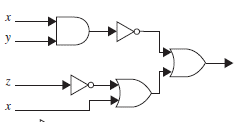
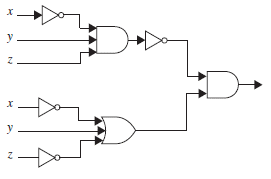
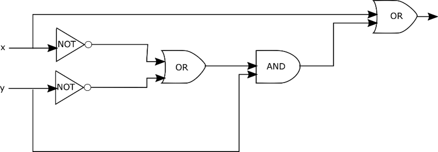
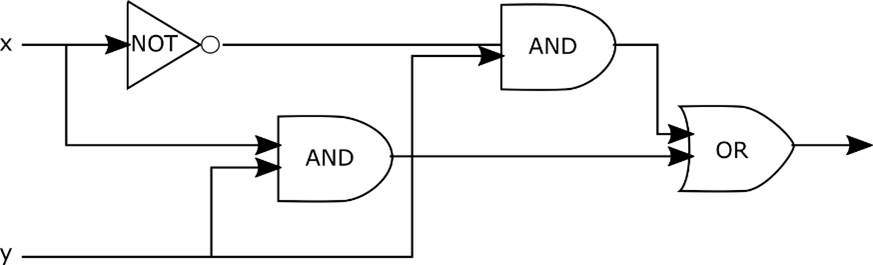
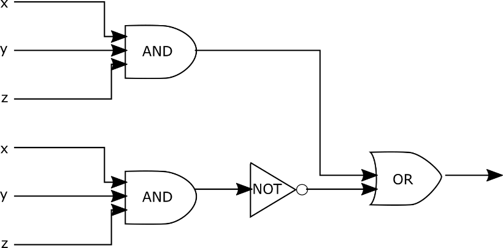

# 4. Boolean Algebra

### Session Preparation:

Brooks: [Chapter 4](https://drive.google.com/file/d/1P9eidJb5qtlZgvHCtqu4uuPa5FFU0Zpn/view?usp=sharing). You should begin reading before class as it will aid your understanding as the topics get more complex.

### Session Material:

[Session notes](https://drive.google.com/file/d/1QYJTRGRS_vWGmcoqSGaMwK5kHDbXKVPm/view?usp=sharing)

[Session Resources](https://viaucdk-my.sharepoint.com/:f:/g/personal/rib_viauc_dk/Er52V3gGu8BDmO9Td0ADo1sBUeAQ8fmZH49f80P2Wt99dw?e=fzBOth)

--------------------------

### Topic Description
In this session, we introduce the foundational concepts of Boolean algebra, which is crucial for understanding digital logic and designing circuits. We will start with the basic Boolean operators AND, OR, and NOT, and then move on to more advanced operators such as NAND, NOR, and XOR. The session will also cover Boolean variables and functions, including how to represent them using truth tables. Additionally, we will explore Boolean identities and their applications in simplifying expressions and designing logic circuits.

#### Key Concepts
- Basic Boolean operators (AND, OR, NOT)
- Advanced Boolean operators (NAND, NOR, XOR)
- Boolean variables and functions
- Truth tables for Boolean functions
- Boolean identities
- Introduction to logic circuits

--------------------------

### Exercises for recitation

#### Exercise 1: Numeral Systems Recap

RGBA is an extension to the (R)ed (G)reen (B)lue color model, which includes an (A)lpha channel representing the level of opacity from $0.0$ to $1.0$, where $0.0$ is fully transparent (i.e. invisible) and $1.0$ is fully opaque.
The four channels are represented by 1 byte (8 bits) each, often expressed in hexadecimal, where for instance # $A01009FF$ corresponds to RGBA($160, 16, 9, 1.0$), a fully opaque medium dark red.

a. What is the maximum decimal value for any of the RGB channels? (1)
{ .annotate }

1. $255$

b. What is the cardinality (or the order) of the set of all possible RGB colors? (1)
{ .annotate }

1. $16^{6} = 16 777 216$

c. What is the cardinality (or the order) of the set of all possible RGBA colors, if all colors with an alpha of $0$ are considered the same? (1)
{ .annotate }

1. $16^{6} \cdot (16^2-1) + 1 = 16 777 216 \cdot 255 + 1 = 4 278 190 081$

d. Express an opacity level of $0.8$ in binary. (1)
{ .annotate }

1. $255 \cdot 0.8 = 204_{10} = 11001100_2$

e. What is the hexadecimal value for an opacity of $0.5$? (1)
{ .annotate }

1. $\approx 7F$ or $80$

#### Exercise 2: Boolean Calculation

Calculate

a. $1 \cdot \overline{1}$ (1)
{ .annotate }

1. $0$

b. $\overline{1} + \overline{0}$ (1)
{ .annotate }  

1. $1$

c. $\overline{0 \cdot (1 + 0)}$ (1)
{ .annotate }

1. $1$

d. $\overline{1} + (0 \cdot 1)$  (1)
{ .annotate }

1. $0$

#### Exercise 3: Boolean Functions
Construct the truth table for

a. $F(x) = x + (x \cdot \overline{x})$

| $x$ | $\overline{x}$ | $(x \cdot \overline{x})$ | $F(x) = x + (x \cdot \overline{x})$ |
|:-:|:------------------:|:--------------------------:|:---------------------------------------:|
|  |         &nbsp;          |                         |                                     |
|  |         &nbsp;          |                          |                                     |

??? answer "&nbsp;"

    | $x$ | $\overline{x}$ | $(x \cdot \overline{x})$ | $F(x) = x + (x \cdot \overline{x})$ |
    |:-:|:------------------:|:--------------------------:|:---------------------------------------:|
    | 0 |         1          |             0              |                   0                    |
    | 1 |         0          |             0              |                   1                    |

b. $G(x,y) = \overline{x} \cdot (\overline{x} + \overline{y})$

??? answer "&nbsp;"

    | $x$ | $y$ | $\overline{x}$ | $\overline{y}$ | $(\overline{x} + \overline{y})$ | $G(x,y)=\overline{x} \cdot (\overline{x} + \overline{y})$ |
    |:-:|:-:|:------------------:|:------------------:|:--------------------------------:|:------------------------------------------------------------:|
    | 0 | 0 |         1          |         1          |               1                |                              1                               |
    | 0 | 1 |         1          |         0          |               1                |                              1                               |
    | 1 | 0 |         0          |         1          |               1                |                              0                               |
    | 1 | 1 |         0          |         0          |               0                |                              0                               |

c. $H(x, y, z) = (x \cdot \overline{y}) + \overline{z}$

??? answer "&nbsp;"

    | $x$ | $y$ | $z$ | $\overline{y}$ | $\overline{z}$ | $(x \cdot \overline{y})$ | $H(x,y,z)=(x \cdot \overline{y}) + \overline{z}$ |
    |:-:|:-:|:-:|:------------------:|:------------------:|:--------------------------:|:--------------------------------------------------------:|
    | 0 | 0 | 0 |         1          |         1          |             0              |                            1                             |
    | 0 | 0 | 1 |         1          |         0          |             0              |                            0                             |
    | 0 | 1 | 0 |         0          |         1          |             0              |                            1                             |
    | 0 | 1 | 1 |         0          |         0          |             0              |                            0                             |
    | 1 | 0 | 0 |         1          |         1          |             1              |                            1                             |
    | 1 | 0 | 1 |         1          |         0          |             1              |                            1                             |
    | 1 | 1 | 0 |         0          |         1          |             0              |                            1                             |
    | 1 | 1 | 1 |         0          |         0          |             0              |                            0                             |

#### Exercise 4: Boolean Expressions

Simplify

a. $(x + \overline{x}) \cdot y$  (1)
{ .annotate }

1. $y$

b. $\overline{x \cdot y}+(\bar{x} \cdot \bar{y})$ (1)
{ .annotate }

1. $\overline{x y}$

c. $x \cdot (y + \overline{x})$ (1)
{ .annotate }

1. $x \cdot y$

d. $\overline{(x+y) \cdot \overline{(x+z)}}$ (1)
{ .annotate }

1. $x + \overline{y} + z$

e. $x \cdot y + \overline{x} \cdot y$ (1)
{ .annotate }

1. $y$

f. $x + y \cdot (\overline{x} + \overline{y})$ (1)
{ .annotate }

1. $x + y$

g. $(x \cdot \overline{y}) + (\overline{x} \cdot y)$  (1)
{ .annotate }

1. $(x \cdot \overline{y}) + (\overline{x} \cdot y)$

h. $x \cdot y \cdot z+\overline{x \cdot y \cdot z}$ (1)
{ .annotate }

1. $1$

#### Exercise 5: Problem

Let $A$ be 1 if you exceed the speed limit, 0 if not.

Let $B$ be 1 if the police sees you, 0 if not.

Let $C$ be 1 if your car is faster than the police car, 0 if not.

a. Create a function $F$ that returns 1 if you get a speeding ticket, 0 if you do not.

??? answer "&nbsp;"

    $F(A,B,C) = A \cdot B \cdot \overline{C}$

    $F(A,B,C) = A \cdot B \cdot 1$ if you are not into car chases.

#### Exercise 6: Interpreting Circuits

Write the boolean expression for

a.

??? answer "&nbsp;"

    $\overline{xy}+(\overline{z}+x)$

b.

??? answer "&nbsp;"

    $\overline{\bar{x} \cdot y z} \cdot(\bar{x}+y+\bar{z})$

#### Exercise 7: Constructing Circuits

Draw the circuits for

a. $x + y \cdot (\overline{x} + \overline{y})$

??? answer "&nbsp;"
    

b. $xy + \overline{x}y$

??? answer "&nbsp;"
    

c. $xyz + \overline{xyz}$

??? answer "&nbsp;"
    

