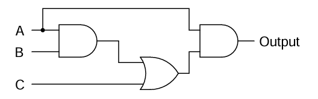

# 5. Introduction to Combinatorics and Probability Theory

### Session Preparation:

Brooks: [Chapter 5](https://drive.google.com/file/d/1P9eidJb5qtlZgvHCtqu4uuPa5FFU0Zpn/view?usp=sharing). You should begin reading before class as it will aid your understanding as the topics get more complex.

### Session Material:

[Session notes](https://drive.google.com/file/d/1JEGYxtYoyv02IglZAgLSkDse-5DkRTLy/view?usp=sharing)

[Session Resources](https://viaucdk-my.sharepoint.com/:f:/g/personal/rib_viauc_dk/EsJDXlP48H5Nnak20uj9FMYBWN_47BOjpk_K1Lso5NxBoA?e=0mp31Z)

--------------------------

### Topic Description
In this session, we delve into the basics of combinatorics and probability theory. We will explore fundamental principles like the multiplication rule, which is essential for understanding how to count outcomes in complex situations. The session will also cover combinations and permutations, both with and without replacement, providing a comprehensive understanding of how to calculate different arrangements and selections. Additionally, we will introduce key concepts in probability theory, such as experiments and sample spaces, the probability of events, and the probability of complements, unions, and differences between events.

#### Key Concepts
- The multiplication rule
- Combinations and permutations (with and without replacement)
- Experiments and sample spaces in probability theory
- The probability of an event
- The probability of the complement, union, and difference between events

--------------------------

### Exercises for Recitation

[Notes from Recitation](https://drive.google.com/file/d/1B4GBM8SKVHwpS_u1LLI3nmfppfDaOpyp/view?usp=sharing)

#### Exercise 1: Boolean Algebra Recap

Consider the Boolean function $F(x, y, z)=x y+y(z+x)$. 

a. State the truth table for this function. If the table is constructed correctly, the last column will contain $F$ and will have 8 rows. Reading the rows from the bottom up will give you a binary value. Convert this value to decimal and state this as your result. (1)
{ .annotate }

1. 200

b. Reduce the expression from (a) as much as possible and create the corresponding logic gate.

??? answer "&nbsp;"
    

c. Use Boolean algebra to simplify the following logic gate circuit and state the result as a boolean algebra expression.

??? answer "&nbsp;"
    $AB+AC$

#### Exercise 2: Combinatorics and Probability

a. An order for a personal digital assistant can specify any one of five memory sizes, any one of three types of displays, any one of four sizes of a hard disk, and can either include or not include a pen tablet. How many different systems can be ordered? State which Rule/Theorem from the book that you use.

??? answer "&nbsp;"
    We multiply the number of possibilities for each of the choices: $5 \cdot 3 \cdot 4 \cdot 2=120$, which means we are using the Theorem 5.1 (Multiplication Rule)

b. A wireless garage door opener has a code determined by the up or down setting of 12 switches.

i. How many possible codes are there?

??? answer "&nbsp;"
    $2^{12} = 4096$

ii. What is the probability that a burglar guesses the right code in the first try?

??? answer "&nbsp;"
    $\frac{1}{4096} = 0.000244 = 0.0244\%$

#### Exercise 3: Combinatorics and Probability

A group of 3 kids is to be formed in a class of 15 kids.

a. In how many different ways can you make the group if the order of the kids doesn't matter?

??? answer "&nbsp;"
    $\frac{15!}{(15-3)!\cdot 3!}=455$

b. In how many different ways can you make the group if the order of the kids does matter?

??? answer "&nbsp;"
    $\frac{15!}{(15-3)!}=2730$

c.	What is the probability that the group will consist of the three kids Xavier, Ygritte and Zelda?

??? answer "&nbsp;"
    $\frac{1}{455}=\frac{6}{2730}=0.00220 = 0.220\%$

#### Exercise 4: Poker Hands
In how many ways can you deal a poker hand of five cards from a standard deck of 52 cards? Also, how many ways are there to select 47 cards from a standard deck of 52 cards?

??? answer "&nbsp;"
    $\frac{52!}{(52-5)!\cdot 5!}=2,598,960$

#### Exercise 5: Garage Doors and Burglars Revisited

Recall the garage doors from Exercise 2b. What is the probability that a burglar guesses the right code in 3 tries, assuming that the guesses happen with replacement, i.e. that the probability for each try is the same?

??? answer "&nbsp;"
    $P($ at least one correct $) = 1-\left(\frac{4095}{4096}\right)^3 \approx 0.00073$

#### Exercise 6: Webpage Passwords
A webpage requires the user to create a password that contains exactly 4 characters. Let $A$ denote the set of passwords containing only letters (there are 26 lowercase letters, a-z, and 26 uppercase letters, A-Z), let $B$ denote the set of passwords containing only numbers (0-9), and let $C$ denote the set of passwords that can contain both letters and numbers.  A hacker tries to guess the password of a particular user. What is the probability that he guesses the correct password in the first attempt in each of the cases below?

a. The webpage only allows passwords from set $A$

??? answer "&nbsp;"
    $\frac{1}{7,311,616}$

b.	 The webpage only allows passwords from set $B$.

??? answer "&nbsp;"
    $\frac{1}{10,000}$

c. The webpage only allows passwords from set $A \cup B$.

??? answer "&nbsp;"
    $\frac{1}{7,321,616}$

d. What is the probability that the hacker guesses the correct password in the first attempt if the webpage allows passwords from set $C$?

??? answer "&nbsp;"
    $\frac{1}{14,776,336}$

#### Exercise 7: Probability
The possible five outcomes of a random experiment are equally likely. The sample space is ${a,b,c,d,e}$. Let $A$ denote the event ${a,b}$, and $B$ denote the event ${c,d,e}$.

a. Draw a Venn diagram showing the sample space and each of the events A and B.

??? answer "&nbsp;"
    

b. Determine each of the following probabilities:

$P(A)$  
$P(B)$  
$P(\overline{A})$  
$P(A \cup B)$  
$P(A \cap B)$

??? answer "&nbsp;"
    $P(A) = \frac{2}{5}$

    $P(B) = \frac{3}{5}$  

    $P(\overline{A}) = \frac{3}{5}$  

    $P(A \cup B) = 1$  

    $P(A \cap B) = 0$

### Exercise 8: Challenge Exercise
A computer password consists of 4 characters, each one of 26 lowercase letters or 26 uppercase letters or an integer between 0 and 9. If the password must contain at least one letter and at least one integer, how many different passwords are possible?

??? answer "&nbsp;"
    The easiest way to calculate this, is to first calculate the number of 4-character passwords, and then subtract those that do not fulfill the rule, i.e. the passwords that do either only contain letters or only numbers: $62^4-52^4-10^4=7,454,720$