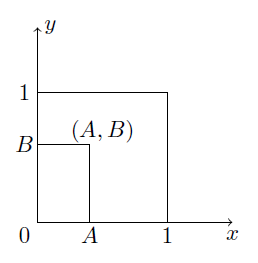

## Exercises: Conditional Probability and Bayes' Theorem

Try to do the exercises without using ChatGPT. If you get stuck, you can use ChatGPT to help you along the way. I don't care if you have the correct answers or not; I care that you try to solve the problems - proritise learning over performance, as that will enhance your performance in the long run. In Denmark we have a saying: Peeing in your pants to keep warm. Using ChatGPT is like peeing in your pants to keep warm; it feels nice at first, but you will regret it later (and may just end up smelling like pee). And if you think about it, "pee" is literally in the word: ChatG-pee-T.

### Exercise 1: Recap

Let $A$ and $B$ be two events such that:

$$
P(A)=0.4, \quad P(B)=0.7, \quad P(A \cup B)=0.9
$$

Find the probabilities below. State your answers as correct to one decimal place.

a. Find $P(A \cap B)$.

 

 

$P(A \cap B)=\underline{\underline{0.2}}$.

 

b. Find $P\left(A^c \cap B\right)$.

 

 

$P\left(A^c \cap B\right)=\underline{\underline{0.5}}$.

 

c. Find $P(A-B)$.

 

 

$P(A-B)=\underline{\underline{0.2}}$

 

d. Find $P\left(A^c-B\right)$.

 

 

$P\left(A^c-B\right)=\underline{\underline{0.1}}$.

 

e. Find $P\left(A^c \cup B\right)$.

 

 

$P\left(A^c \cup B\right)=\underline{\underline{0.8}}$.

 

f. Find $P\left(A \cap\left(B \cup A^c\right)\right)$.

 

 

$P\left(A \cap\left(B \cup A^c\right)\right)=\underline{\underline{0.2}}$.

 

### Exercise 2: Heart Failure

Heart failures are due to either natural occurrences $(87 \%)$ or outside factors $(13 \%)$. Outside factors are related to induced substances ( $73 \%$ ) or foreign objects ( $27 \%$ ). Natural occurrences are caused by arterial blockage ( $56 \%$ ), disease ( $27 \%$ ), and infection (e.g., staph infection) ( $17 \%$ ). State your answers as correct to four decimal places.

a. Determine the probability that a failure is due to an induced substance.

 

 

$0.13 \times 0.73=\underline{\underline{0.0949}}$

 

b. Determine the probability that a failure is due to disease or infection.

 

 

 $0.87 \times(0.27+0.17)=\underline{\underline{0.3828}}$

 

### Exercise 3: Venn and Probability

Let $A, B$, and $C$ be three events with probabilities given:

Find the probabilites below. State you answers as irreducible fractions.

a. $P(A \mid B)$

 

 

$\dfrac{4}{7}$

 

b. $P(C \mid B)$

 

 

$\dfrac{3}{7}$

 

c. $P(B \mid A \cup C)$

 

 

$\dfrac{5}{14}$

 

d. $P(B \mid (A, C))$

 

 

$\dfrac{1}{2}$

 

### Exercise 4: More Planes
The probability that a regularly scheduled flight departs on time is $0.83$; the probability that it arrives on time is $0.82$; and the probability that it departs and arrives on time is $0.78$. Find the probability that a plane. State your answers as correct to four decimal places.

a. Arrives on time, given that it departed on time

 

 

0.9398

 

b. Departed on time, given that it has arrived on time

 

 

0.9512

 

c. Arrives on time, given that it did not depart on time

 

 

0.2353

 

### Exercises 5: Independence and Contingency Tables
A survey was conducted to determine the employment rate of recently graduated engineering students. The survey was conducted one year after graduation and was made for ICT Engineers, Civil Engineers, Mechanical Engineers, and Global Business Engineers. The graduates were classified in one of two employment categories: (1) employed/studying and (2) unemployed. 40% of the respondents had studied ICT Engineering and of these 85% were employed/studying. Of all the respondents, 20% were unemployed. Of the 100 former civil engineering students who took part in the survey, 20% were unemployed. The proportion of unemployed Mechanical and Civil engineering students was the same and the survey included exactly 9 unemployed mechanical engineering students. 300 students took part in the survey.

a. Based on this information, construct a 2 x 4 contingency table for the survey results.

 

 

Technically, the sums and totals are not part of the contingency tables. They are added to make it easier to calculate the probabilities.

 

b. What is the probability that an unemployed respondent is a former ICT student? State your answer as an irreducible fraction.

 

 

$\dfrac{3}{10}$

 

c. If a respondent is unemployed, what is the probability that the respondent was a GBE student? State your answer as an irreducible fraction.

 

 

$\dfrac{13}{60}$

 

d. Is being unemployed independent from being a former ICT student?

 

 

You can compare any a priori probability with the corresponding a posteriori probability. E.g. you found an aposteriori probability of $\dfrac{3}{10}$ in (b). The a priori probability is $\dfrac{2}{5}$. Since the two probabilities are not equal, the two events are dependent:

$P(\text{ICT} \mid \text{Unemployed}) = \dfrac{3}{10} \neq \dfrac{2}{5} = P(\text{ICT})$

 

### Exercise 6: Bayes' Theorem
Disease $A$ occurs with probability 0.1, and disease $B$ occurs with probability 0.2. It is not possible to have both diseases. You have a single test. This test reports positive with probability 0.8 for a patient with disease $A$, with probability 0.5 for a patient with disease $B$, and with probability 0.01 for a patient with no disease - call the latter event $W$. Stating your answer as correct to four decimal places, if the test comes back positive, what is the probability you have either:

a. Disease $A$

b. Disease $B$ or

c. No disease

Note: You need to calculate three probabilities; one for each of the three events stated in a-c.

 

 

a. Disease $A$: 0.4278

b. Disease $B$: 0.5348

c. No disease: 0.0374

 

### Exercise 7: Challenge Exercise
Only use time on this exercise if you have time left after completing the other exercises and you found them too easy. The problem is taken from the exam in Stochastic Modelling and Processes (IT-SMP1) on the 6th/7th semester.

You choose a point $(A, B)$ uniformly at random in the unit square $\{(x, y): 0 \leq x, y \leq 1\}$.

    

What is the probability that the equation

$$
A X^2+X+B=0
$$

has real solutions?

[solution](https://www.uio.no/studier/emner/matnat/math/STK1100/h20/eksamen/losningsforslag/eksamen-2020-12-15.pdf)