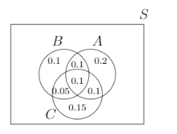
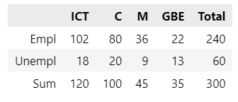
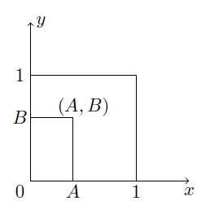

# 6. Conditional Probability and Bayes Theorem

### Session Preparation:

Brooks: [Chapter 6](https://drive.google.com/file/d/1P9eidJb5qtlZgvHCtqu4uuPa5FFU0Zpn/view?usp=sharing). You should begin reading before class as it will aid your understanding as the topics get more complex.

### Session Material:

[Session notes](https://drive.google.com/file/d/1wAMVD7qDRDlnW3YCHzxZjgo79k14Z6uz/view?usp=sharing)

[Session Resources](https://viaucdk-my.sharepoint.com/:f:/g/personal/rib_viauc_dk/El6TyZ3UNqZDmv4WaAnaxdQBqhXftjEPeBzsfKRGOU6lDg?e=8E2jvl)

--------------------------

### Topic Description
Building on our introduction to probability, this session delves deeper into the subject by exploring the concepts of dependent and independent events. We will discuss how the occurrence of one event can affect the probability of another. Conditional probability will be introduced, highlighting how probabilities change when additional information is known. We will also cover the probability of intersections between events, helping to understand overlapping occurrences. Contingency tables will be used to organize data and calculate probabilities effectively, and we will conclude with Bayes' theorem, a powerful tool for updating probabilities based on new evidence.

#### Key Concepts
- Dependent and independent events
- Conditional probability
- The probability for the intersection between events
- Contingency tables
- Bayes' theorem

--------------------------

### Exercises for recitation

Try to do the exercises without using ChatGPT. If you get stuck, you can use ChatGPT to help you along the way. I don't care if you have the correct answers or not; I care that you try to solve the problems - proritise learning over performance, as that will enhance your performance in the long run.

#### Exercise 1: Recap

Let $A$ and $B$ be two events such that:

$$
P(A)=0.3, \quad P(B)=0.2, \quad P(A \cap B)=0.1
$$

Find the probabilities below. State your answers as correct to one decimal place.

a. Find $P(A^c)$. (1)
{ .annotate }

1. $P(A^c)=0.7$.

b. Find $P\left(A \cup B\right)$. (1)
{ .annotate }

1. $P\left(A \cup B\right)=0.4$.

c. Find $P\left(A^c \cap B\right)$. (1)
{ .annotate }

1. $P\left(A^c \cap B\right)=0.1$

d. Find $P\left(A \cap B^c\right)$. (1)
{ .annotate }

1. $P\left(A \cap B^c\right)=0.2$.

e. Find $P\left((A \cup B)^c\right)$. (1)
{ .annotate }

1. $P\left((A \cup B)^c\right)=0.6$.

f. Find $P\left(A^c \cup B\right)$. (1)
{ .annotate }

1. $P\left(A^c \cup B\right)=0.8$.

#### Exercise 2: Rolling Fair Die

I roll a fair die twice and obtain two numbers: $X_1=$ result of the first roll, $X_2=$ result of the second roll.

a. Find the probability that $X_2=4$. (1)
{ .annotate }

1. $\dfrac{1}{6}$

b. Find the probability that $X_1+X_2=7$. (1)
{ .annotate }

1. $\dfrac{1}{6}$

c. Find the probability that $X_1 \neq 2$ and $X_2 \geq 4$. (1)
{ .annotate }

1. $\dfrac{5}{12}$

#### Exercise 3: Venn and Probability

Let $A, B$, and $C$ be three events with probabilities given:

Find the probabilities below. State you answers as irreducible fractions.

a. $P(A \mid B)$ (1)
{ .annotate }

1. $\dfrac{4}{7}$

b. $P(C \mid B)$ (1)
{ .annotate }

1. $\dfrac{3}{7}$

c. $P(B \mid A \cup C)$ (1)
{ .annotate }

1. $\dfrac{5}{14}$

d. $P(B \mid (A, C))$ (1)
{ .annotate }

1. $\dfrac{1}{2}$

#### Exercise 4: More Planes
The probability that a regularly scheduled flight departs on time is $0.83$; the probability that it arrives on time is $0.82$; and the probability that it departs and arrives on time is $0.78$. Find the probability that a plane. State your answers as correct to four decimal places.

a. Arrives on time, given that it departed on time (1)
{ .annotate }

1. 0.9398

b. Departed on time, given that it has arrived on time (1)
{ .annotate }

1. 0.9512

c. Arrives on time, given that it did not depart on time (1)
{ .annotate }

1. 0.2353

 

#### Exercises 5: Independence and Contingency Tables
A survey was conducted to determine the employment rate of recently graduated engineering students. The survey was conducted one year after graduation and was made for ICT Engineers, Civil Engineers, Mechanical Engineers, and Global Business Engineers. The graduates were classified in one of two employment categories: (1) employed/studying and (2) unemployed. 40% of the respondents had studied ICT Engineering and of these 85% were employed/studying. Of all the respondents, 20% were unemployed. Of the 100 former civil engineering students who took part in the survey, 20% were unemployed. The proportion of unemployed Mechanical and Civil engineering students was the same and the survey included exactly 9 unemployed mechanical engineering students. 300 students took part in the survey.

a. Based on this information, construct a 2 x 4 contingency table for the survey results.

??? answer "&nbsp;"
    

    Technically, the sums and totals are not part of the contingency tables. They are added to make it easier to calculate the probabilities.

b. What is the probability that an unemployed respondent is a former ICT student? State your answer as an irreducible fraction. (1)
{ .annotate }

1. $\dfrac{3}{10}$

c. If a respondent is unemployed, what is the probability that the respondent was a GBE student? State your answer as an irreducible fraction. (1)
{ .annotate }

1. $\dfrac{13}{60}$

d. Is being unemployed independent from being a former ICT student? (1)
{ .annotate }

??? answer "&nbsp;"
    You can compare any a priori probability with the corresponding a posteriori probability. E.g. you found an aposteriori probability of $\dfrac{3}{10}$ in (b). The a priori probability is $\dfrac{2}{5}$. Since the two probabilities are not equal, the two events are dependent:

    $P(\text{ICT} \mid \text{Unemployed}) = \dfrac{3}{10} \neq \dfrac{2}{5} = P(\text{ICT})$

#### Exercise 6: Bayes' Theorem
Disease $A$ occurs with probability 0.1, and disease $B$ occurs with probability 0.2. It is not possible to have both diseases. You have a single test. This test reports positive with probability 0.8 for a patient with disease $A$, with probability 0.5 for a patient with disease $B$, and with probability 0.01 for a patient with no disease - call the latter event $W$. Stating your answer as correct to four decimal places, if the test comes back positive, what is the probability you have either:

a. Disease $A$

b. Disease $B$ or

c. No disease

Note: You need to calculate three probabilities; one for each of the three events stated in a-c.

??? answer "&nbsp;"
    a. Disease $A$: 0.4278

    b. Disease $B$: 0.5348

    c. No disease: 0.0374

#### Exercise 7: Challenge Exercise
Only use time on this exercise if you have time left after completing the other exercises and you found them too easy. The problem is taken from the exam in Stochastic Modelling and Processes (IT-SMP1) on the 6th/7th semester.

You choose a point $(A, B)$ uniformly at random in the unit square $\{(x, y): 0 \leq x, y \leq 1\}$.

    

What is the probability that the equation

$$
A X^2+X+B=0
$$

has real solutions?

[solution](Solution7.pdf)

### Additional Solutions
[Some Python Solutions](https://github.com/RBrooksDK/MSE1/blob/main/06_Conditional_Probability_and_Bayes_Theorem/some_solutions.ipynb)

[Solutions made in class](https://drive.google.com/open?id=1lCgiFIzOLAuDSEQjUyeZiyWsWt63Ex8d&usp=drive_fs)