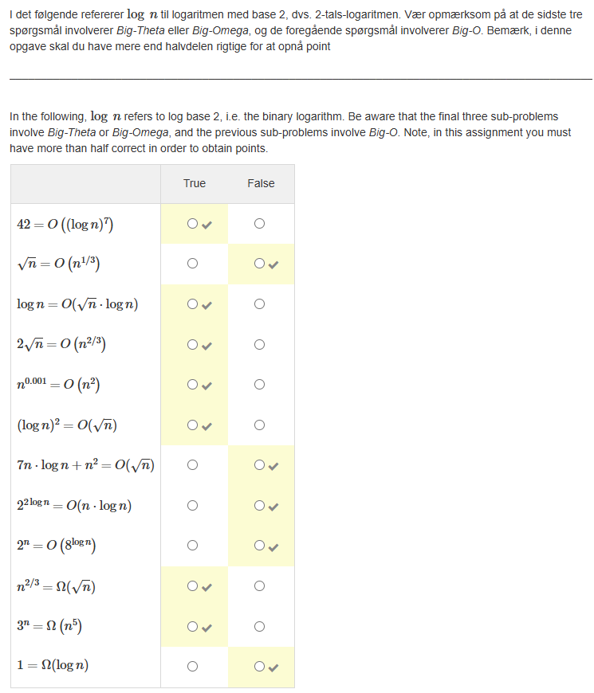

# 10. Asymptotic analysis and Big O notation

### Session Preparation:

Brooks: [Chapter 10](https://drive.google.com/file/d/1P9eidJb5qtlZgvHCtqu4uuPa5FFU0Zpn/view?usp=sharing). You should begin reading before class as it will aid your understanding as the topics get more complex.

### Session Material:

[Session Resources](https://viaucdk-my.sharepoint.com/:f:/g/personal/rib_viauc_dk/Eql9J0ssd15HumyWWOVSuEoBcnNt7n6v8APYzbEPKq8kvw?e=eg8aH3)

--------------------------

In this session, we delve into the foundational concepts of algorithms and their analysis. We will begin by exploring what algorithms are and why they are central to computer science and mathematics. The session will introduce asymptotic notation, which is crucial for describing the efficiency of algorithms. We will examine time complexity, focusing on how to analyse the performance of algorithms as the input size grows. Additionally, we will cover growth functions to understand how different algorithms scale and how to perform asymptotic analysis using limits.

### Key Concepts:
- Introduction to Algorithms
- Asymptotic Notation
- Time Complexity
- Asymptotic Analysis and Limits
--------------------------

### Exercises for Recitation:

#### Exercise 1: Asymptotic Notation
Order the following by their $\mathcal{O}(\cdot)$ ranking

$$
\begin{aligned}
& n^2 \\
& \log n \\
& n \sqrt{n} \\
& 2^n \\
& n \log n \\
& n! \\
& \log \log n \\
& n \\
& n^n \\
& \frac{n^2}{\log n}
\end{aligned}
$$

??? answer "&nbsp;"

    To order these functions by their Big $\mathcal{O}$ notation, we arrange them from the smallest growth rate to the largest growth rate:

    1. \( \log \log n \)
    2. \( \log n \)
    3. \( n \)
    4. \( n \log n \)
    5. \( n \sqrt{n} \)
    6. \( \frac{n^2}{\log n} \)
    7. \( n^2 \)
    8. \( 2^n \)
    9.  \( n! \)
    10. \( n^n \)

    So, in Big $\mathcal{O}$ order:

    \[
    \log \log n \prec \log n \prec n \prec n \log n \prec n \sqrt{n} \prec \frac{n^2}{\log n} \prec n^2 \prec 2^n \prec n!\prec n^n
    \]


#### Exercise 2: Time Complexity
Which of the following are true?

a. $4 n^2=\mathcal{O}\left(n^2\right)$(1)
{ .annotate }

1. True

b. $4 n^2+18 n \log n=\mathcal{O}\left(n^2\right)$(1)
{ .annotate }

1. True

c. $4 n^2+18 n \log n=\mathcal{O}(n)$(1)
{ .annotate }

1. False

d. $4 n^2+18 n \log n=\mathcal{O}(n \log n)$(1)
{ .annotate }

1. False

e. $4 n+18 n \log n=\mathcal{O}(n \log n)$(1)
{ .annotate }

1. True

f. $4 n+18 n \log n=\mathcal{O}\left(n^2\right)$(1)
{ .annotate }

1. True

#### Exercise 3: Theta Notation

Write the following using $\Theta$ notation:

\[
\begin{array}{ll}
\text{a. } n^2+\frac{n^3}{2} & \text{f. } 8 \log_2^7 n + 34 \log_2 n + \frac{1}{1000} n \\
\text{b. } 2^n + n^4 & \text{g. } 2^n - 7 + 5 \log_2^3 n \\
\text{c. } \log_2 n + n \sqrt{n} & \text{h. } n \left(n^2 - 18\right) \log_2 n \\
\text{d. } n(n - 6) & \text{i. } n \log_2^4 n + n^2 \\
\text{e. } 4 \sqrt{n} & \text{j. } n^3 \log_2 n + \sqrt{n} \log_2^7 n
\end{array}
\]

??? answer "&nbsp;"

    \[
    \begin{array}{ll}
    \text{a. } \Theta(n^3) & \text{f. } \Theta(\log_2^7 n) \\
    \text{b. } \Theta(2^n) & \text{g. } \Theta(2^n) \\
    \text{c. } \Theta(n \sqrt{n}) & \text{h. } \Theta(n^3 \log_2 n) \\
    \text{d. } \Theta(n^2) & \text{i. } \Theta(n^2) \\
    \text{e. } \Theta(\sqrt{n}) & \text{j. } \Theta(n^3 \log_2 n)
    \end{array}
    \]

#### Exercise 4: Asymptotic Analysis
The following problem is identical to how we will state one type of problems in the exam.


??? answer "&nbsp;"

    

#### Exercise 5: Scaling Up: How Big Can We Go?
An algorithm takes 0.5 ms for input size 100. How large a problem (i.e. the size of input $n$) can be solved in 1 min if the running time is the following (assume low-order terms are negligible):

a. linear

b. $O(n \log n)$  (Hard problem, skip if you want. You need to use approximation to solve this.)

c. quadratic

d. cubic

??? answer "&nbsp;"

    
    $\text {Linear: } n \approx 12,000,000$

    $O(n \log n): n \approx 3,660,000$ (see (Python Solution)[])
    
    $\text {Quadratic: } n \approx 34,641$ 
    
    $\text {Cubic: } n \approx 4,932$

#### Exercise 6: Exponential Growth

a. Is \( 2^{n+1} = O(2^n) \)? Explain why or why not. If not, what is then the correct Big \( \mathcal{O} \) notation?

??? answer "&nbsp;"

    Yes. \( 2^{n+1} = O(2^n) \) because \( 2^{n+1} = 2 \cdot 2^n \) and \( 2 \) is a constant factor.


b. Is \( 2^{2n} = O(2^n) \)? Explain why or why not. If not, what is then the correct Big \( \mathcal{O} \) notation?

??? answer "&nbsp;"

    No. $2^{2 n}=\left(2^n\right)^2$ and this grows significantly faster than $2^n$ because $2^{2 n}$ is actually the square of $2^n$. In other words:

    $$
    2^{2 n} \neq O\left(2^n\right)
    $$

    but is in fact \( 2^{2n} = O(4^n) \) because \( 2^{2n} = (2^2)^n = 4^n \).

#### Exercise 7: Coding Exercise

Below you see some Python code to do some operation:
 
```python
for i in range(len(A)):
    for j in range(len(B[0])):
        for k in range(len(B)):
            C[i][j] += A[i][k] * B[k][j]
for r in C:
    print(r)
```
$A$ and $B$ are two matrices and $C$ is another empty matrix (actually it just has zeroes on all entries). A matrix is simply a 2 d -array, i.e. $A, B$, and $C$ are `int [] []` in Java.

a. Figure out what exactly the code does. (1)
{ .annotate }

1. Matrix multiplication

b. What is the time complexity of the algorithm? (1)
{ .annotate }

1. $\mathcal{O}\left(n^3\right)$.

c. Implement the algorithm in Java

??? answer "&nbsp;"

    ```java
    // Assume initialisation has been done:
    // int C[][] = new int[A.length][B[0].length];

    // Core logic for multiplying two matrices
    for (int i = 0; i < A.length; i++) {
        for (int j = 0; j < B[0].length; j++) {
            for (int k = 0; k < B.length; k++) {
                C[i][j]+= A[i][k] * B[k][j];
            }
        }
    }
    
    // Print the result
    for (int[] row : C) {
        for (int value : row) {
            System.out.print(value + " ");
        }
        System.out.println();
    }
    ```
