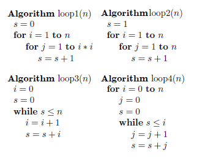
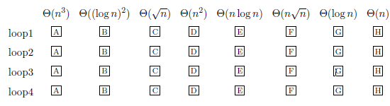
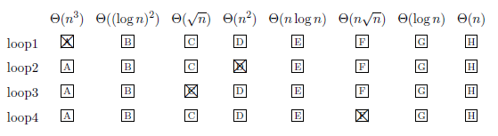
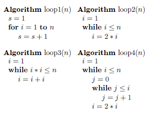
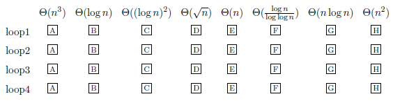
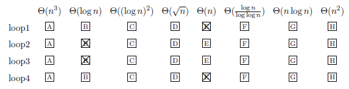

# 11. Code Analysis Techniques

### Session Preparation:

Brooks: [Chapter 11](https://drive.google.com/file/d/1P9eidJb5qtlZgvHCtqu4uuPa5FFU0Zpn/view?usp=sharing). You should begin reading before class as it will aid your understanding as the topics get more complex.

Brooks: MSE_in_SEP1 (in Session Material)

### Session Material:

[Notes: Loop Analysis](https://drive.google.com/file/d/112ojchm4x7U1SV6b31_cUMcfJROmNvnZ/view?usp=sharing)

[Session Resources](https://viaucdk-my.sharepoint.com/:f:/g/personal/rib_viauc_dk/EnwGIx3PNuJHmDljj0r5POsB2j5n658Vxcqrw0s2iVcznQ?e=p5WKpf)

--------------------------

In this session, we focus on two fundamental concepts in programming: functions and loops. We'll begin by analysing loops, including how they operate and their role in programming, with a particular focus on understanding the performance implications of different types of loops. We will also explore functions in depth, examining their structure, usage, and importance in writing efficient and reusable code. Special attention will be given to hash functions, which are critical in many areas of computer science, including data retrieval and security. By the end of this session, you'll have a solid understanding of how loops and functions work, how to analyse their performance, and how to use them effectively in your code.

### Key Concepts:
- Pseudocode
- Loop Analysis
- Types of Loops (e.g., for loops, while loops)
- Performance Implications of Loops
- Functions in Programming (also called methods in Java)
- Structure and Usage of Functions

--------------------------

### Exercises for recitation

Manual solutions for loops: [Loop Analysis](https://drive.google.com/file/d/1wsupXIbqnTGKTXrjxd8VqlP7SFKAxuW_/view?usp=sharing)

#### Exercise 1: Asymptotic Notation

a. Order the following by their $\mathcal{O}(\cdot)$ ranking. $\log n$ is the logarithm of $n$ to the base 2.

$$
\begin{aligned}
& n^{1 / 3} \log n \\
& 2^{\log n} \\
& 17 \sqrt{n} \\
& 3 n^2 \\
& \frac{1}{4} \log ^4 n \\
& n^{0.75}
\end{aligned}
$$

??? answer "&nbsp;"
    1. **\(n^{1/3} \log n\):**
         - The dominant term is \(n^{1/3}\), as \(\log n\) grows slower than any polynomial.
         - Growth rate: \(\mathcal{O}(n^{1/3} \log n) \approx \mathcal{O}(n^{1/3})\).

    2. **\(2^{\log n}\):**
         - Using the property \(2^{\log n} = n\), this simplifies to a linear growth.
         - Growth rate: \(\mathcal{O}(n)\).

    3. **\(17 \sqrt{n}\):**
         - The dominant term is \(\sqrt{n} = n^{1/2}\), and the constant factor \(17\) is irrelevant in \(\mathcal{O}\)-notation.
         - Growth rate: \(\mathcal{O}(n^{1/2})\).

    4. **\(3n^2\):**
         - The dominant term is \(n^2\), and the constant \(3\) is irrelevant in \(\mathcal{O}\)-notation.
         - Growth rate: \(\mathcal{O}(n^2)\).

    5. **\(\frac{1}{4} \log^4 n\):**
         - The dominant term is \(\log^4 n\), and the constant factor \(\frac{1}{4}\) is irrelevant.
         - Growth rate: \(\mathcal{O}(\log^4 n)\).

    6. **\(n^{0.75}\):**
         - The dominant term is \(n^{0.75}\).
         - Growth rate: \(\mathcal{O}(n^{0.75})\).
   
    Now, order the functions by their growth rates from slowest to fastest:

    \[
    \frac{1}{4} \log^4 n \prec n^{1/3} \log n \prec 17 \sqrt{n} \prec n^{0.75} \prec 2^{\log n} \prec 3n^2
    \]

b. Determine whether the following statements are true or false:

\[
\begin{aligned}
& 3 n^4+2 n^3=O\left(n^3\right) \\
& 4 n+45 \log n=\Theta(n) \\
& \frac{1}{3} n^5=\Omega\left(n^4\right) \\
& \left(\frac{1}{3} n^5+n^2+n\right) n=O\left(n^6\right) \\
& 2^{n+2}=\Theta\left(2^n\right)
\end{aligned}
\]

??? answer "&nbsp;"
    False, True, True, True, True

#### Exercise 2: Lucky Loops

Note: Loop 4 is a challenge exercise. In order to solve it, you will need the following approximation:

\[
\sum_{i=0}^n \sqrt{2i} \approx \sqrt{2} \int_0^n \sqrt{x} d x=\frac{2\sqrt{2}}{3} n^{3 / 2}
\]



For each of the above algorithms, state its execution time as a function of $n$ in $\Theta$-notation.



??? answer "&nbsp;"
    

#### Exercise 3: Lovely Loops



For each of the above algorithms, state its execution time as a function of $n$ in $\Theta$-notation.



??? answer "&nbsp;"
    

#### Exercise 4: I've Got the Power

The following code snippet calculates $x^n$. We are given two integers, and the algorithm returns an integer. Find the time complexity of the algorithm.

```java	
// Algorithm1 - Iterative
public static long power1(int x, int n)
{
    // initialize result by 1
    long pow = 1L;
        
    // multiply x exactly n times
    for (int i = 0; i < n; i++) {
        pow = pow * x;
    }
    return pow;
}
```
??? answer "&nbsp;"
    The time complexity of Algorithm1 is $\mathcal{O}(n)$.
